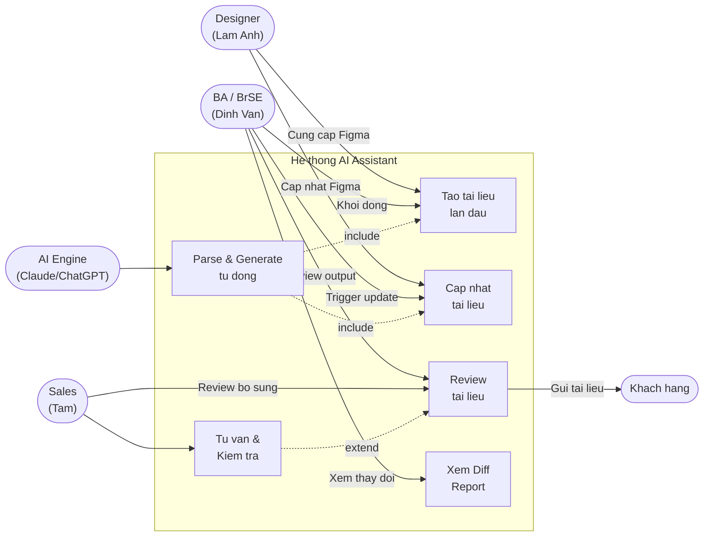

## 1. Danh sách Actor

| Actor | Loại | Mô tả |
|-------|------|-------|
| Designer | Người dùng ngoài | Tạo và cập nhật thiết kế trên Figma |
| BA / BrSE | Người dùng chính | Vận hành hệ thống, review và approve tài liệu |
| AI Engine | Hệ thống | Xử lý tự động: parse, generate, mapping |
| Khách hàng | Người nhận kết quả | Nhận tài liệu đặc tả để phê duyệt |

---

## 2. Sơ đồ Actor và Vai trò

---

## 3. Chi tiết Từng Actor

### 3.1 Designer (Lâm Anh – BrSE, phụ trách Design & Test)

| Trường | Nội dung |
|--------|----------|
| **Vai trò** | Tạo và duy trì thiết kế trên Figma |
| **Tương tác với hệ thống** | Gián tiếp – không dùng tool trực tiếp |
| **Trách nhiệm** | Đảm bảo Figma file đúng cấu trúc, tuân thủ naming convention |
| **Quyền hạn** | Chỉnh sửa Figma, không có quyền trên tool AI |

**Yêu cầu từ Designer:**
- Đặt tên Frame: `[ScreenID]_[ScreenName]` (ví dụ: `SC01_Login`)
- Đặt tên Component: `btn_`, `inp_`, `txt_`, `tbl_`, `modal_`
- Thiết lập Prototype connections đầy đủ trước khi trigger generate

---

### 3.2 BA / BrSE (Đình Văn – BrSE, có nền Dev)

| Trường | Nội dung |
|--------|----------|
| **Vai trò** | Người dùng chính – vận hành và kiểm soát hệ thống |
| **Tương tác với hệ thống** | Trực tiếp – sử dụng tool để generate và review |
| **Trách nhiệm** | Nhập Figma URL, trigger generate, review output, approve và gửi khách |
| **Quyền hạn** | Toàn quyền trên tool: configure, run, approve, export |

---

### 3.3 Sales (Tâm – Sales)

| Trường | Nội dung |
|--------|----------|
| **Vai trò** | Tư vấn và review thêm từ góc độ kinh doanh |
| **Tương tác với hệ thống** | Gián tiếp – nhận tài liệu từ BA để review |
| **Trách nhiệm** | Đảm bảo tài liệu đáp ứng kỳ vọng khách hàng |
| **Quyền hạn** | Chỉ xem và comment, không thay đổi trực tiếp |

---

### 3.4 AI Engine (Claude / ChatGPT)

| Trường | Nội dung |
|--------|----------|
| **Vai trò** | Xử lý tự động toàn bộ pipeline AI |
| **Giới hạn** | Không tự approve hay gửi tài liệu – luôn cần con người review |

---

## 4. Ma trận Phân quyền

| Chức năng | Designer | BA/BrSE | Sales | AI Engine |
|-----------|----------|---------|-------|-----------|
| Chỉnh sửa Figma | ✅ | ❌ | ❌ | ❌ |
| Trigger Initial Setup | ❌ | ✅ | ❌ | ❌ |
| Trigger Update Mode | ❌ | ✅ | ❌ | ❌ |
| Parse & Generate tự động | ❌ | ❌ | ❌ | ✅ |
| Review tài liệu | ❌ | ✅ | ✅ | ❌ |
| Approve tài liệu | ❌ | ✅ | ⚠️ (tư vấn) | ❌ |
| Gửi tài liệu cho khách | ❌ | ✅ | ✅ | ❌ |