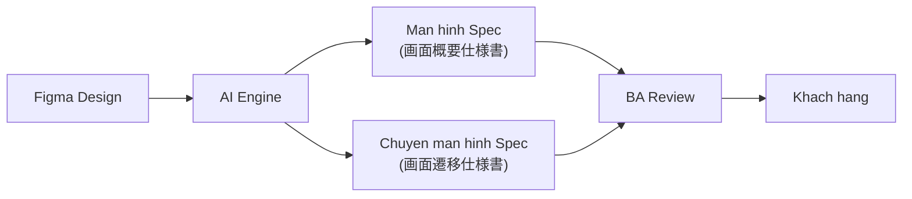

# Tài Liệu Phân Tích Yêu Cầu Hệ Thống
## AI Assistant Tự Động Hóa Tài Liệu Figma → Excel

> **Phiên bản:** 1.0 &nbsp;|&nbsp; **Ngày tạo:** 2026-06-02 &nbsp;|&nbsp; **Tác giả:** Đình Văn (BrSE/Dev)

---

## Tổng quan nhanh

| Hạng mục | Nội dung |
|----------|----------|
| **Vấn đề giải quyết** | Tự động hóa tạo tài liệu đặc tả từ Figma → Excel, giảm 80%+ thời gian |
| **2 luồng chính** | Initial Setup (tạo lần đầu) + Update Mode (cập nhật theo phần) |
| **Đầu ra** | 画面概要仕様書 + 画面遷移仕様書 (Excel, tiếng Nhật) |
| **Người dùng chính** | BA/BrSE – vận hành tool, review và approve |
| **AI vai trò** | Parse + Generate + Mapping (không tự approve) |
| **Thời gian mục tiêu** | < 2 phút/screen (vs 20~60 phút thủ công) |

---

## Cấu trúc tài liệu

| Phần | Nội dung |
|------|----------|
| [01 · Tổng quan Hệ thống](/tong-quan) | Bối cảnh, mục tiêu, kiến trúc |
| [02 · Yêu cầu Chức năng](/yeu-cau-chuc-nang) | Use case, đặc tả UC01 & UC02 |
| [03 · Luồng Vận hành](/luong-van-hanh) | Flowchart & Sequence diagram |
| [04 · Đối tượng Sử dụng](/doi-tuong-su-dung) | Actor, phân quyền |
| [05 · Yêu cầu Phi chức năng](/yeu-cau-phi-chuc-nang) | Hiệu năng, bảo mật, ràng buộc |