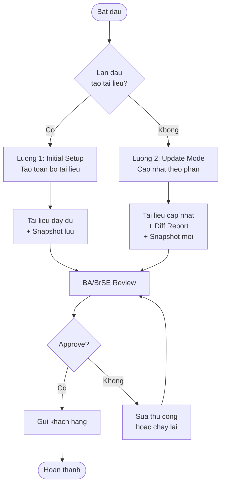

## Danh sách luồng

| # | Tên luồng | Mô tả | File |
|---|-----------|-------|------|
| 1 | Initial Setup | Tạo toàn bộ tài liệu lần đầu từ Figma | [Luồng 1](./luong-01-initial) |
| 2 | Update Mode | Phát hiện thay đổi và cập nhật tài liệu theo phần | [Luồng 2](./luong-02-update) |
| 3 | Sequence Diagram | Tương tác chi tiết giữa AI và Con người | [Sequence](./sequence-diagram) |

---

## Sơ đồ Tổng quan Hai Luồng

