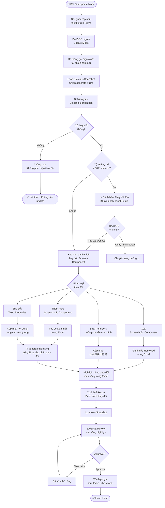
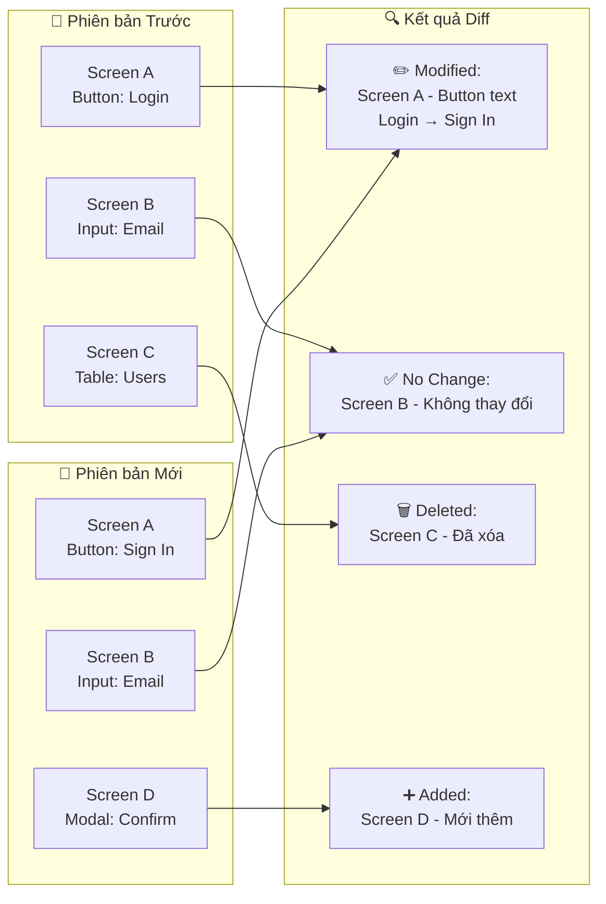

## 1. Mô tả

Luồng này được thực hiện **mỗi khi Designer cập nhật Figma** sau lần initial setup. Thay vì tạo lại toàn bộ tài liệu, hệ thống chỉ xác định phần thay đổi và cập nhật đúng section tương ứng trong Excel, giảm thiểu effort và tránh ghi đè nội dung đã được BA chỉnh sửa.

---

## 2. Sơ đồ Luồng Chính (Mermaid)



---

## 3. Sơ đồ Diff Analysis (Mermaid)



---

## 4. Phân loại và Xử lý Thay đổi

| Loại thay đổi | Phát hiện bằng | Hành động trong Excel | Highlight |
|--------------|---------------|----------------------|-----------|
| Thêm màn hình mới | Frame ID không có trong snapshot | Tạo section mới cuối file | 🟡 Vàng |
| Xóa màn hình | Frame ID không còn trong Figma | Đánh dấu "【削除】" đầu dòng | 🔴 Đỏ nhạt |
| Sửa text/label | Nội dung text thay đổi | Ghi đè cell tương ứng | 🟡 Vàng |
| Thêm component | Component ID mới xuất hiện | Thêm dòng mới vào bảng | 🟡 Vàng |
| Xóa component | Component ID biến mất | Đánh dấu "【削除】" | 🔴 Đỏ nhạt |
| Sửa prototype | Connection thay đổi | Cập nhật 画面遷移仕様書 | 🟡 Vàng |

---

## 5. Diff Report – Mẫu Nội dung

```
=== DIFF REPORT ===
Thời gian: 2025-01-15 14:30:00
Figma Version: v42 → v43

📊 Tổng kết:
  - Thêm mới:   2 screens, 5 components
  - Sửa đổi:    3 screens, 12 components
  - Xóa:        1 screen,  3 components
  - Không đổi:  8 screens

📋 Chi tiết:
  [ADDED]    Screen D - Confirm Modal
  [MODIFIED] Screen A - Button "Login" → "Sign In"
  [MODIFIED] Screen B - Input placeholder text
  [DELETED]  Screen C - User Table Screen
```

---

## 6. Điều kiện tiên quyết để Update Mode hoạt động

| Điều kiện | Lý do |
|-----------|-------|
| Đã chạy Initial Setup ít nhất 1 lần | Cần snapshot để so sánh |
| Snapshot chưa bị xóa | Diff Analysis dựa vào snapshot |
| File Excel hiện tại còn nguyên cấu trúc | Để merge đúng section |
| BA không đổi tên sheet/section Excel | Mapping dựa vào tên |
