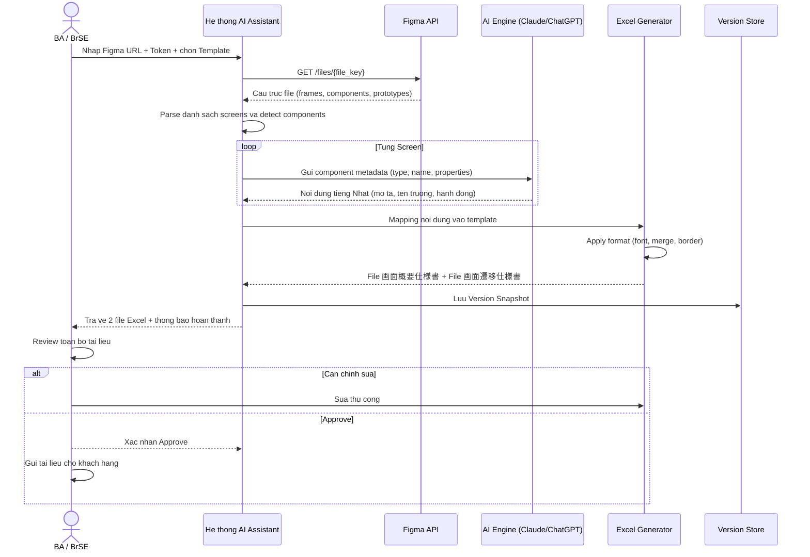
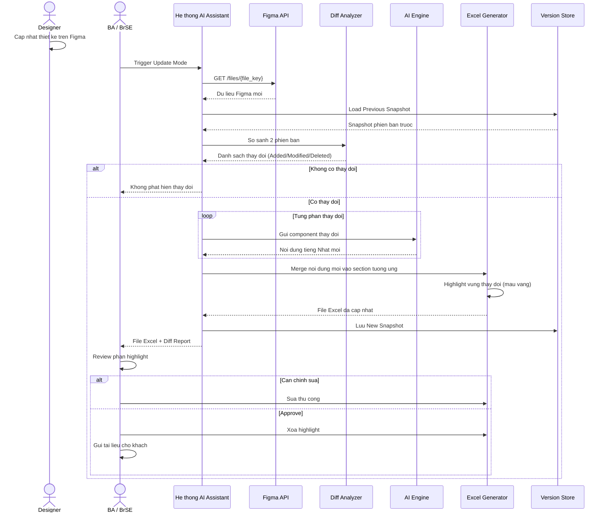
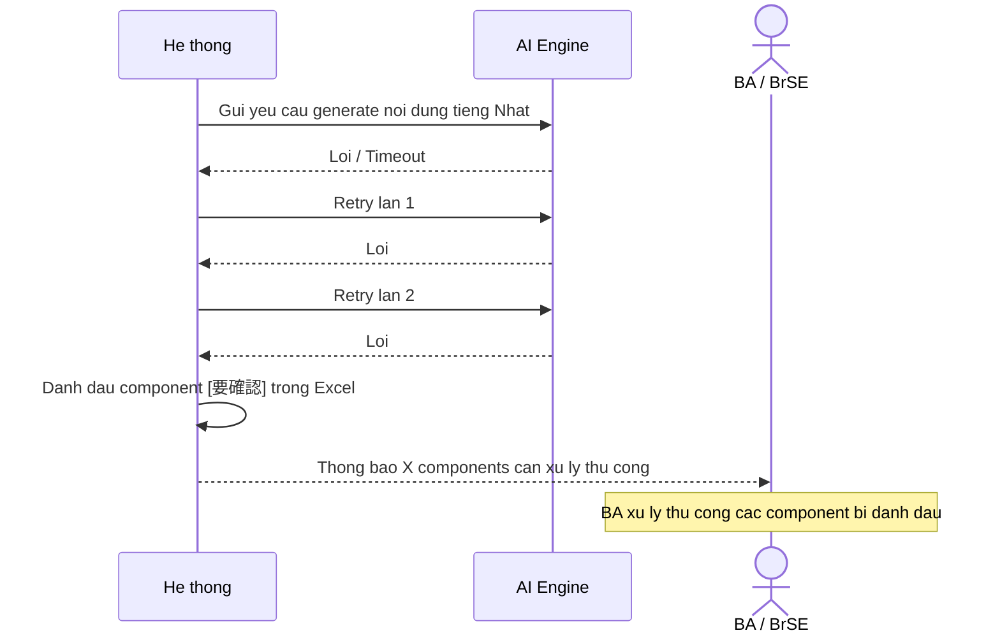

## 1. Sequence – Initial Setup

```mermaid
sequenceDiagram
    actor BA as BA / BrSE
    participant SYS as He thong AI Assistant
    participant FAPI as Figma API
    participant AI as AI Engine (Claude/ChatGPT)
    participant EXCEL as Excel Generator
    participant DB as Version Store

    BA->>SYS: Nhap Figma URL + Token + chon Template
    SYS->>FAPI: GET /files/{file_key}
    FAPI-->>SYS: Cau truc file (frames, components, prototypes)
    SYS->>SYS: Parse danh sach screens va detect components

    loop Tung Screen
        SYS->>AI: Gui component metadata (type, name, properties)
        AI-->>SYS: Noi dung tieng Nhat (mo ta, ten truong, hanh dong)
    end

    SYS->>EXCEL: Mapping noi dung vao template
    EXCEL->>EXCEL: Apply format (font, merge, border)
    EXCEL-->>SYS: File 画面概要仕様書 + File 画面遷移仕様書
    SYS->>DB: Luu Version Snapshot
    SYS-->>BA: Tra ve 2 file Excel + thong bao hoan thanh
    BA->>BA: Review toan bo tai lieu

    alt Can chinh sua
        BA->>EXCEL: Sua thu cong
    else Approve
        BA-->>SYS: Xac nhan Approve
        BA->>BA: Gui tai lieu cho khach hang
    end
```

---

## 2. Sequence – Update Mode

```mermaid
sequenceDiagram
    actor DS as Designer
    actor BA as BA / BrSE
    participant SYS as He thong AI Assistant
    participant FAPI as Figma API
    participant DIFF as Diff Analyzer
    participant AI as AI Engine
    participant EXCEL as Excel Generator
    participant DB as Version Store

    DS->>DS: Cap nhat thiet ke tren Figma
    BA->>SYS: Trigger Update Mode
    SYS->>FAPI: GET /files/{file_key}
    FAPI-->>SYS: Du lieu Figma moi
    SYS->>DB: Load Previous Snapshot
    DB-->>SYS: Snapshot phien ban truoc
    SYS->>DIFF: So sanh 2 phien ban
    DIFF-->>SYS: Danh sach thay doi (Added/Modified/Deleted)

    alt Khong co thay doi
        SYS-->>BA: Khong phat hien thay doi
    else Co thay doi
        loop Tung phan thay doi
            SYS->>AI: Gui component thay doi
            AI-->>SYS: Noi dung tieng Nhat moi
        end
        SYS->>EXCEL: Merge noi dung moi vao section tuong ung
        EXCEL->>EXCEL: Highlight vung thay doi (mau vang)
        EXCEL-->>SYS: File Excel da cap nhat
        SYS->>DB: Luu New Snapshot
        SYS-->>BA: File Excel + Diff Report
        BA->>BA: Review phan highlight

        alt Can chinh sua
            BA->>EXCEL: Sua thu cong
        else Approve
            BA->>EXCEL: Xoa highlight
            BA->>BA: Gui tai lieu cho khach
        end
    end
```

---

## 3. Sequence – Xử lý Lỗi AI Generate

```mermaid
sequenceDiagram
    participant SYS as He thong
    participant AI as AI Engine
    actor BA as BA / BrSE

    SYS->>AI: Gui yeu cau generate noi dung tieng Nhat
    AI-->>SYS: Loi / Timeout
    SYS->>AI: Retry lan 1
    AI-->>SYS: Loi
    SYS->>AI: Retry lan 2
    AI-->>SYS: Loi
    SYS->>SYS: Danh dau component [要確認] trong Excel
    SYS-->>BA: Thong bao X components can xu ly thu cong
    Note over BA: BA xu ly thu cong cac component bi danh dau
```