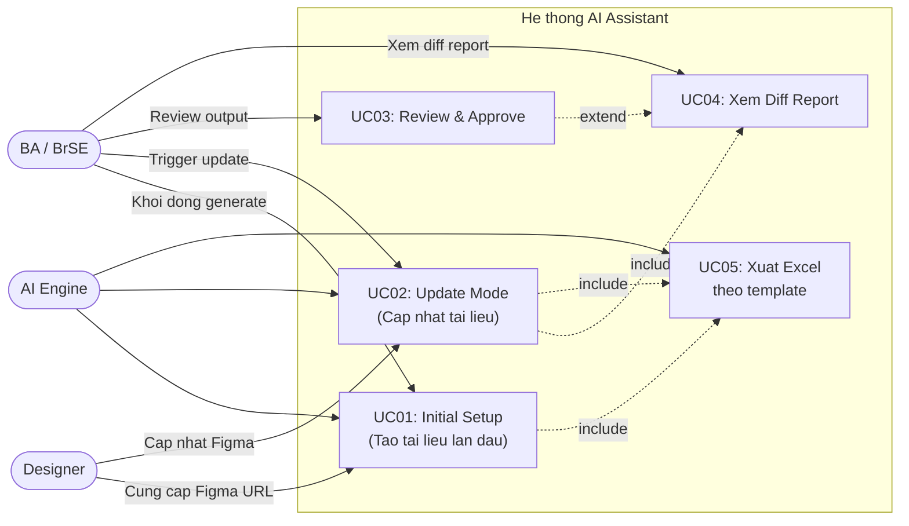

## 1. Danh sách Use Case

---

## 2. Bảng Tóm tắt Use Case

| UC | Tên chức năng | Actor chính | Ưu tiên |
|----|--------------|-------------|---------|
| UC01 | Tạo tài liệu lần đầu (Initial Setup) | BA/BrSE + AI | Cao |
| UC02 | Cập nhật tài liệu theo phần (Update Mode) | BA/BrSE + AI | Cao |
| UC03 | Review và Approve tài liệu | BA/BrSE | Cao |
| UC04 | Xem báo cáo thay đổi (Diff Report) | BA/BrSE | Trung bình |
| UC05 | Xuất file Excel theo template | AI Engine | Cao |

---

## 3. Chi tiết từng Use Case

- [UC01 – Initial Setup](./uc01-initial-setup)
- [UC02 – Update Mode](./uc02-update-mode)