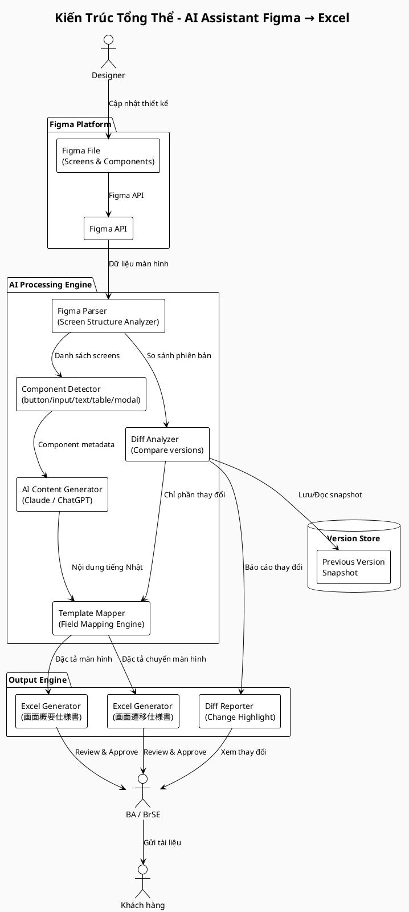
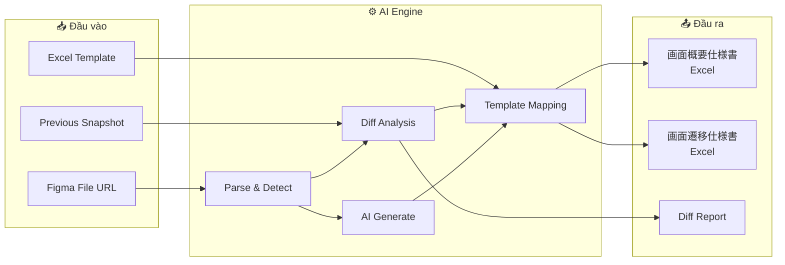

# Kiến Trúc Tổng Thể Hệ Thống

## 1. Sơ đồ Kiến trúc Thành phần (PlantUML)

---

## 2. Mô tả các Thành phần

### 2.1 Figma Platform

| Thành phần | Mô tả |
|-----------|-------|
| **Figma File** | File thiết kế chứa tất cả màn hình, component, prototype |
| **Figma API** | REST API để đọc dữ liệu cấu trúc từ Figma |

### 2.2 AI Processing Engine

| Thành phần | Mô tả |
|-----------|-------|
| **Figma Parser** | Phân tích cấu trúc file Figma, trích xuất danh sách màn hình và metadata |
| **Component Detector** | Nhận dạng từng loại component: button, input, text, table, modal, transition |
| **Diff Analyzer** | So sánh phiên bản hiện tại với phiên bản trước, xác định phần thay đổi |
| **AI Content Generator** | Dùng AI (Claude/ChatGPT) để generate nội dung mô tả tiếng Nhật |
| **Template Mapper** | Mapping nội dung đã generate vào đúng field/section trong Excel template |

### 2.3 Output Engine

| Thành phần | Mô tả |
|-----------|-------|
| **Excel Generator (概要仕様書)** | Tạo/cập nhật file tài liệu đặc tả màn hình |
| **Excel Generator (遷移仕様書)** | Tạo/cập nhật file tài liệu đặc tả chuyển màn hình |
| **Diff Reporter** | Highlight vùng thay đổi, xuất báo cáo diff |

### 2.4 Version Store

| Thành phần | Mô tả |
|-----------|-------|
| **Previous Version Snapshot** | Lưu trữ snapshot phiên bản trước để so sánh khi có cập nhật |

---

## 3. Sơ đồ Luồng Dữ liệu (Mermaid)

---

## 4. Nguyên tắc Thiết kế

1. **Tách biệt AI và Template:** AI chỉ generate nội dung, Template Mapper xử lý việc đặt đúng vị trí trong Excel
2. **Không regenerate toàn bộ khi update:** Chỉ xử lý phần thay đổi để tiết kiệm thời gian và tránh ghi đè nội dung đã review
3. **Con người luôn là bước cuối:** AI generate, con người review và approve trước khi gửi khách
4. **Lưu trữ snapshot:** Mỗi lần generate thành công đều lưu snapshot để phục vụ diff lần sau
