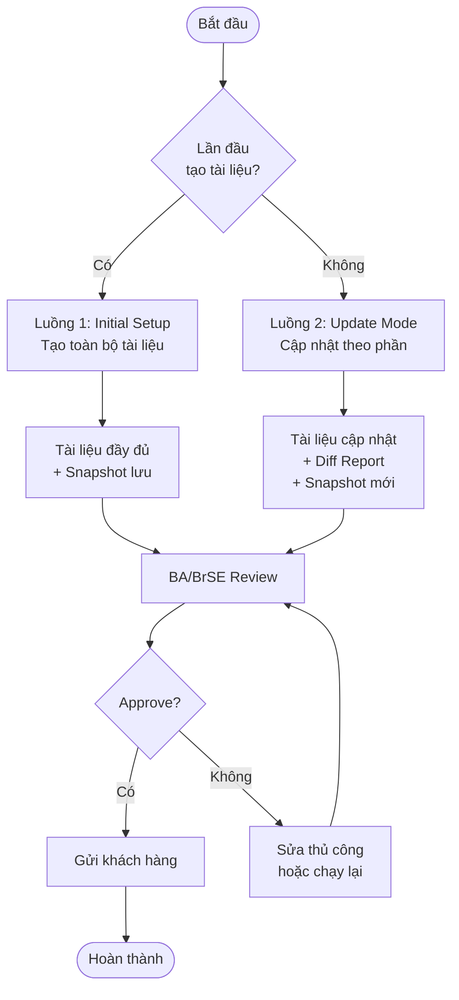

# Các Luồng Vận Hành Chính

## Danh sách luồng

| # | Tên luồng | Mô tả | File |
|---|-----------|-------|------|
| 1 | Initial Setup | Tạo toàn bộ tài liệu lần đầu từ Figma | [luong-01-initial.md](./luong-01-initial.md) |
| 2 | Update Mode | Phát hiện thay đổi và cập nhật tài liệu theo phần | [luong-02-update.md](./luong-02-update.md) |
| 3 | Sequence Diagram | Tương tác chi tiết giữa AI và Con người | [sequence-diagram.md](./sequence-diagram.md) |

---

## Sơ đồ Tổng quan Hai Luồng (Mermaid)

