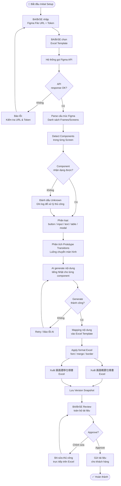
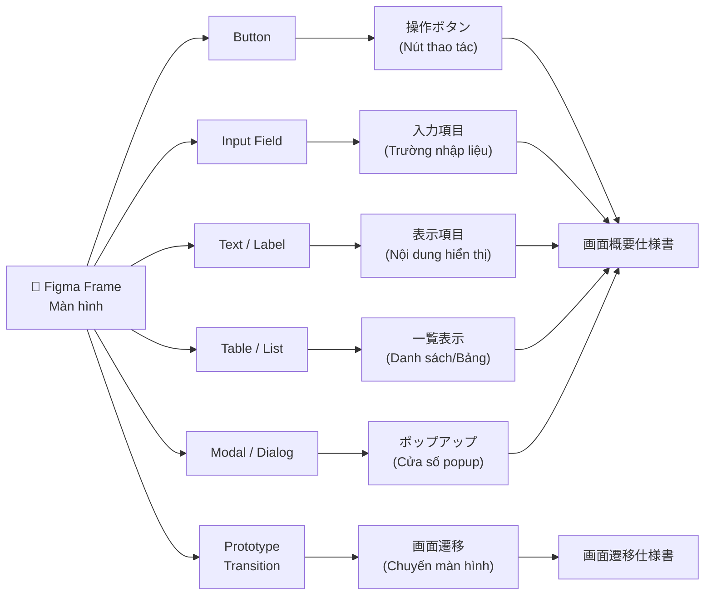

# Luồng 1 – Initial Setup (Tạo Tài Liệu Lần Đầu)

## 1. Mô tả

Luồng này được thực hiện **một lần duy nhất** khi bắt đầu dự án hoặc khi cần generate lại toàn bộ tài liệu từ đầu. Hệ thống sẽ đọc toàn bộ file Figma, phân tích từng màn hình và component, generate nội dung tiếng Nhật và xuất ra 2 file Excel đặc tả.

---

## 2. Sơ đồ Luồng Chính (Mermaid)

---

## 3. Sơ đồ Phân tích Component (Mermaid)

---

## 4. Mapping Rule – Component sang Excel

| Component Figma | Loại nhận dạng | Cột trong Excel | Ghi chú |
|----------------|---------------|----------------|---------|
| Button (Primary) | 操作ボタン | ボタン名 / 処理内容 | Tên + mô tả hành động |
| Button (Secondary) | 操作ボタン | ボタン名 / 処理内容 | Phân biệt qua màu/style |
| Input Text | 入力項目 | 項目名 / 入力形式 | Tên trường + kiểu nhập |
| Dropdown | 入力項目 | 項目名 / 選択肢 | Tên + danh sách option |
| Text (heading) | 表示項目 | タイトル | Tiêu đề màn hình |
| Text (body) | 表示項目 | 表示内容 | Nội dung hiển thị |
| Table/List | 一覧表示 | 一覧名 / カラム構成 | Tên bảng + cột |
| Modal/Dialog | ポップアップ | ポップアップ名 / 表示条件 | Tên + điều kiện hiện |
| Prototype Arrow | 画面遷移 | 遷移元 / 遷移先 / 条件 | Màn hình nguồn → đích + điều kiện |

---

## 5. Kết quả Đầu ra

| Tài liệu | Nội dung | Format |
|----------|----------|--------|
| 画面概要仕様書 | Toàn bộ màn hình, component, mô tả tiếng Nhật | Excel (.xlsx) |
| 画面遷移仕様書 | Toàn bộ luồng chuyển màn hình, điều kiện | Excel (.xlsx) |
| Version Snapshot | Dữ liệu Figma tại thời điểm generate | JSON/DB |
