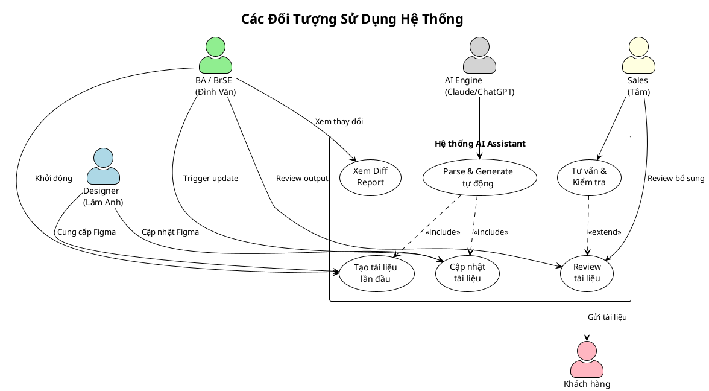

# Các Đối Tượng Sử Dụng Hệ Thống

## 1. Danh sách Actor

| Actor | Loại | Mô tả |
|-------|------|-------|
| Designer | Người dùng ngoài | Tạo và cập nhật thiết kế trên Figma |
| BA / BrSE | Người dùng chính | Vận hành hệ thống, review và approve tài liệu |
| AI Engine | Hệ thống | Xử lý tự động: parse, generate, mapping |
| Khách hàng | Người nhận kết quả | Nhận tài liệu đặc tả để phê duyệt |

---

## 2. Sơ đồ Actor và Vai trò (PlantUML)

---

## 3. Chi tiết Từng Actor

### 3.1 Designer (Lâm Anh – BrSE, phụ trách Design & Test)

| Trường | Nội dung |
|--------|----------|
| **Vai trò** | Tạo và duy trì thiết kế trên Figma |
| **Tương tác với hệ thống** | Gián tiếp – không dùng tool trực tiếp |
| **Trách nhiệm** | Đảm bảo Figma file đúng cấu trúc, tuân thủ naming convention |
| **Quyền hạn** | Chỉnh sửa Figma, không có quyền trên tool AI |

**Yêu cầu từ Designer:**
- Đặt tên Frame theo quy ước: `[ScreenID]_[ScreenName]` (ví dụ: `SC01_Login`)
- Đặt tên Component theo loại: `btn_`, `inp_`, `txt_`, `tbl_`, `modal_`
- Thiết lập Prototype connections đầy đủ trước khi trigger generate

---

### 3.2 BA / BrSE (Đình Văn – BrSE, có nền Dev)

| Trường | Nội dung |
|--------|----------|
| **Vai trò** | Người dùng chính – vận hành và kiểm soát hệ thống |
| **Tương tác với hệ thống** | Trực tiếp – sử dụng tool để generate và review |
| **Trách nhiệm** | Nhập Figma URL, trigger generate, review output, approve và gửi khách |
| **Quyền hạn** | Toàn quyền trên tool: configure, run, approve, export |

**Công việc chính:**
1. Nhập Figma URL + Access Token vào hệ thống
2. Chọn Excel template phù hợp
3. Trigger Initial Setup hoặc Update Mode
4. Review tài liệu được generate
5. Sửa thủ công nếu cần (business logic, wording tiếng Nhật)
6. Approve và gửi cho khách hàng

---

### 3.3 Sales (Tâm – Sales)

| Trường | Nội dung |
|--------|----------|
| **Vai trò** | Tư vấn và review thêm từ góc độ kinh doanh |
| **Tương tác với hệ thống** | Gián tiếp – nhận tài liệu từ BA để review |
| **Trách nhiệm** | Đảm bảo tài liệu đáp ứng kỳ vọng khách hàng |
| **Quyền hạn** | Chỉ xem và comment, không thay đổi trực tiếp |

---

### 3.4 AI Engine (Claude / ChatGPT)

| Trường | Nội dung |
|--------|----------|
| **Vai trò** | Xử lý tự động toàn bộ pipeline AI |
| **Tương tác** | Nhận input từ Figma Parser, trả về nội dung tiếng Nhật |
| **Trách nhiệm** | Parse component, generate nội dung, mapping vào template |
| **Giới hạn** | Không tự approve hay gửi tài liệu – luôn cần con người review |

---

### 3.5 Khách hàng

| Trường | Nội dung |
|--------|----------|
| **Vai trò** | Người nhận và phê duyệt tài liệu cuối cùng |
| **Tương tác** | Không tương tác với hệ thống, chỉ nhận file Excel |
| **Kỳ vọng** | Tài liệu đúng format, nội dung tiếng Nhật chuẩn xác |

---

## 4. Ma trận Phân quyền

| Chức năng | Designer | BA/BrSE | Sales | AI Engine |
|-----------|----------|---------|-------|-----------|
| Chỉnh sửa Figma | ✅ | ❌ | ❌ | ❌ |
| Trigger Initial Setup | ❌ | ✅ | ❌ | ❌ |
| Trigger Update Mode | ❌ | ✅ | ❌ | ❌ |
| Parse & Generate tự động | ❌ | ❌ | ❌ | ✅ |
| Review tài liệu | ❌ | ✅ | ✅ | ❌ |
| Sửa thủ công Excel | ❌ | ✅ | ❌ | ❌ |
| Approve tài liệu | ❌ | ✅ | ⚠️ (tư vấn) | ❌ |
| Gửi tài liệu cho khách | ❌ | ✅ | ✅ | ❌ |
