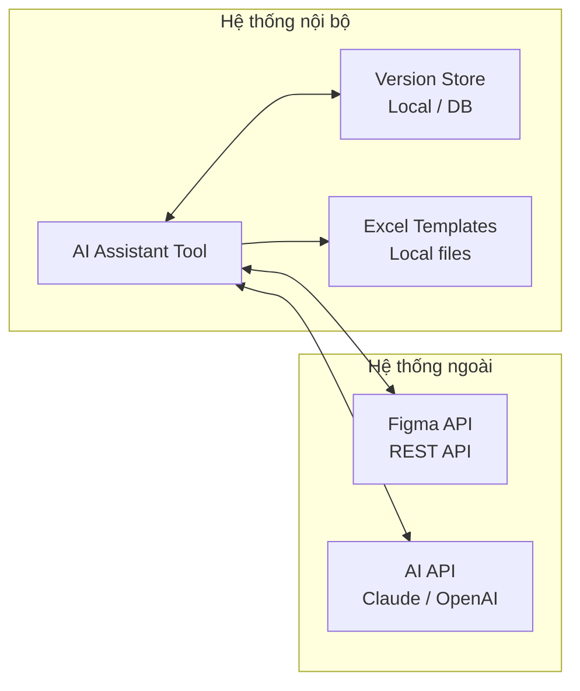

# Yêu Cầu Phi Chức Năng

## 1. Hiệu Năng (Performance)

| # | Yêu cầu | Chỉ số mục tiêu | Ghi chú |
|---|---------|----------------|---------|
| PF01 | Thời gian generate 1 màn hình | < 2 phút | Bao gồm AI generate + mapping |
| PF02 | Thời gian Initial Setup (10 screens) | < 20 phút | So với 200~600 phút thủ công |
| PF03 | Thời gian Diff Analysis | < 30 giây | So sánh 2 snapshot |
| PF04 | Thời gian Update Mode (screen đơn) | < 3 phút | Chỉ xử lý phần thay đổi |
| PF05 | Kích thước file Excel đầu ra | < 10 MB | Để dễ gửi email |

---

## 2. Độ Tin cậy (Reliability)

| # | Yêu cầu | Mô tả |
|---|---------|-------|
| RL01 | Không mất dữ liệu khi lỗi | Nếu generate thất bại, Excel hiện tại phải được giữ nguyên |
| RL02 | Retry tự động khi AI timeout | Retry tối đa 3 lần trước khi báo lỗi |
| RL03 | Snapshot luôn được lưu sau generate thành công | Đảm bảo Update Mode luôn có dữ liệu so sánh |
| RL04 | Log đầy đủ các bước xử lý | Để debug khi có lỗi |
| RL05 | Không ghi đè phần BA đã chỉnh sửa thủ công | Update Mode chỉ thay đổi đúng section tương ứng |

---

## 3. Bảo mật (Security)

| # | Yêu cầu | Mô tả |
|---|---------|-------|
| SC01 | Figma Access Token không lưu dạng plaintext | Mã hóa hoặc dùng environment variable |
| SC02 | Tài liệu không gửi ra ngoài khi chưa được Approve | Con người phải action gửi thủ công |
| SC03 | Giới hạn quyền truy cập Figma API | Chỉ đọc (read-only scope), không ghi lên Figma |
| SC04 | Không lưu nội dung thiết kế lên cloud bên thứ 3 | Dữ liệu xử lý cục bộ hoặc server nội bộ |

---

## 4. Khả năng Bảo trì (Maintainability)

| # | Yêu cầu | Mô tả |
|---|---------|-------|
| MT01 | Template Excel có thể thay đổi mà không cần code | Mapping rule cấu hình qua file config |
| MT02 | Thêm loại component mới không phá vỡ hệ thống | Component detector có thể mở rộng |
| MT03 | AI prompt có thể chỉnh sửa độc lập | Prompt lưu riêng, không hardcode trong logic |
| MT04 | Log đủ chi tiết để debug | Level: INFO / WARNING / ERROR |

---

## 5. Khả năng Tích hợp (Integration)



| Tích hợp | Phương thức | Xác thực |
|---------|------------|---------|
| Figma API | REST API (HTTPS) | Personal Access Token |
| Claude API | REST API (HTTPS) | API Key |
| OpenAI API | REST API (HTTPS) | API Key |
| Excel Templates | Local file system | Không cần |
| Version Store | Local DB hoặc file JSON | Không cần |

---

## 6. Ràng buộc Kỹ thuật (Technical Constraints)

| # | Ràng buộc | Chi tiết |
|---|-----------|---------|
| TC01 | Ngôn ngữ tài liệu đầu ra | Tiếng Nhật (日本語) |
| TC02 | Format tài liệu đầu ra | Excel (.xlsx) – theo template định sẵn |
| TC03 | Figma API rate limit | Tối đa 300 request/phút – cần xử lý throttling |
| TC04 | AI API cost | Mỗi lần generate tốn token – cần tối ưu prompt |
| TC05 | Naming convention Figma | Phải tuân thủ quy ước đặt tên để nhận dạng đúng |
| TC06 | Excel template không được thay đổi cấu trúc | Chỉ thay đổi nội dung trong vùng quy định |

---

## 7. Quy ước Naming Convention Figma

> **Quan trọng:** Hệ thống phụ thuộc vào naming convention để nhận dạng component. BA/BrSE cần thống nhất với Designer trước khi bắt đầu.

### Quy tắc đặt tên Frame (Màn hình)

```
[ScreenID]_[ScreenName]
Ví dụ: SC01_Login, SC02_Dashboard, SC03_UserList
```

### Quy tắc đặt tên Component

| Prefix | Loại Component | Ví dụ |
|--------|---------------|-------|
| `btn_` | Button | `btn_Login`, `btn_Cancel` |
| `inp_` | Input field | `inp_Email`, `inp_Password` |
| `txt_` | Text / Label | `txt_Title`, `txt_Description` |
| `tbl_` | Table / List | `tbl_UserList`, `tbl_OrderHistory` |
| `modal_` | Modal / Dialog | `modal_Confirm`, `modal_Error` |
| `nav_` | Navigation | `nav_Header`, `nav_Sidebar` |

---

## 8. Tiêu chí Chấp nhận (Acceptance Criteria)

| # | Tiêu chí | Cách kiểm tra |
|---|---------|--------------|
| AC01 | Generate 10 screens trong < 20 phút | Đo thời gian thực tế |
| AC02 | 0% miss component (với naming convention chuẩn) | So sánh với kết quả thủ công |
| AC03 | Format Excel khớp 100% template | Review trực quan + script kiểm tra |
| AC04 | Nội dung tiếng Nhật được BA xác nhận đúng | BA/BrSE review và sign-off |
| AC05 | Update Mode không ghi đè phần đã sửa thủ công | Test case: sửa thủ công → chạy update → kiểm tra |
| AC06 | Diff Report liệt kê đúng 100% thay đổi | Tạo test case với thay đổi đã biết trước |
