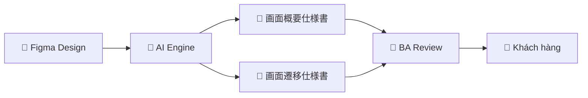

# Tài Liệu Phân Tích Yêu Cầu Hệ Thống
## AI Assistant Tự Động Hóa Tài Liệu Figma → Excel

> **Phiên bản:** 1.0  
> **Ngày tạo:** 2026-06-02  
> **Tác giả:** Đình Văn (BrSE/Dev)

---

## Mục lục

### [01. Tổng Quan Hệ Thống](./01_tong-quan/README.md)
Giới thiệu, bối cảnh, mục tiêu, phạm vi và thành viên dự án.

| File | Nội dung |
|------|----------|
| [README.md](./01_tong-quan/README.md) | Tổng quan, vấn đề, mục tiêu, phạm vi |
| [kien-truc-tong-the.md](./01_tong-quan/kien-truc-tong-the.md) | Kiến trúc component + luồng dữ liệu (PlantUML + Mermaid) |

---

### [02. Yêu Cầu Chức Năng](./02_yeu-cau-chuc-nang/README.md)
Danh sách use case và đặc tả chi tiết từng chức năng.

| File | Nội dung |
|------|----------|
| [README.md](./02_yeu-cau-chuc-nang/README.md) | Use case diagram tổng quan (PlantUML) |
| [UC01_initial-setup.md](./02_yeu-cau-chuc-nang/UC01_initial-setup.md) | Đặc tả UC01: Tạo tài liệu lần đầu |
| [UC02_update-mode.md](./02_yeu-cau-chuc-nang/UC02_update-mode.md) | Đặc tả UC02: Cập nhật tài liệu theo phần |

---

### [03. Các Luồng Vận Hành Chính](./03_luong-van-hanh/README.md)
Sơ đồ chi tiết các luồng xử lý bằng Mermaid và PlantUML.

| File | Nội dung |
|------|----------|
| [README.md](./03_luong-van-hanh/README.md) | Tổng quan 2 luồng chính (Mermaid) |
| [luong-01-initial.md](./03_luong-van-hanh/luong-01-initial.md) | Flowchart Initial Setup + Mapping Rule (Mermaid) |
| [luong-02-update.md](./03_luong-van-hanh/luong-02-update.md) | Flowchart Update Mode + Diff Analysis (Mermaid) |
| [sequence-diagram.md](./03_luong-van-hanh/sequence-diagram.md) | Sequence diagram AI ↔ Con người (PlantUML) |

---

### [04. Các Đối Tượng Sử Dụng](./04_doi-tuong-su-dung/README.md)
Phân tích actor, vai trò, quyền hạn và ma trận phân quyền.

| File | Nội dung |
|------|----------|
| [README.md](./04_doi-tuong-su-dung/README.md) | Actor diagram + Chi tiết từng đối tượng + Ma trận phân quyền |

---

### [05. Yêu Cầu Phi Chức Năng](./05_yeu-cau-phi-chuc-nang/README.md)
Hiệu năng, độ tin cậy, bảo mật, tích hợp và các ràng buộc kỹ thuật.

| File | Nội dung |
|------|----------|
| [README.md](./05_yeu-cau-phi-chuc-nang/README.md) | Performance, Security, Maintainability, Constraints, Acceptance Criteria |

---

## Tóm tắt Nhanh

| Hạng mục | Nội dung |
|----------|----------|
| **Vấn đề giải quyết** | Tự động hóa tạo tài liệu đặc tả từ Figma → Excel, giảm 80%+ thời gian |
| **2 luồng chính** | Initial Setup (tạo lần đầu) + Update Mode (cập nhật theo phần) |
| **Đầu ra** | 画面概要仕様書 + 画面遷移仕様書 (Excel, tiếng Nhật) |
| **Người dùng chính** | BA/BrSE – vận hành tool, review và approve |
| **AI vai trò** | Parse + Generate + Mapping (không tự approve) |
| **Thời gian mục tiêu** | < 2 phút/screen (vs 20~60 phút thủ công) |
